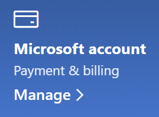

# Microsofti konto teabe muutmineChange my Microsoft account information

Avage [https://account.microsoft.com](https://account.microsoft.com/) ja logige vajaduse korral sisse.Go to [https://account.microsoft.com](https://account.microsoft.com/) and sign in if necessary. See avab teie konto andmelaua.This will take you to your account dashboard.  

**Nime ja isikuandmete redigeerimine****Edit my name and personal information**

1. Klõpsake konto armatuurlaual kontopildi ja nime kõrval kolme punkti (rohkem toiminguid) > profiili\*\*.On your account dashboard, next to your account picture and name, click the three dots (more actions) > Edit profile\*\*.
2. Saate profiilipildi, nime, sünniaja ja asukoha muutmiseks ning keele eelistuste kuvamiseks kasutada **profiili redigeerimislehel** olevaid linke.On the **Edit profile** page, use the links provided to change your profile picture, name, date of birth, location, and display language preference. Pange tähele, et xBoxi või Skype’i konto profiili jaoks on eraldi lingid, mille kaudu saate muuta nende kontode üksikasju.Note the links to your Xbox or Skype account profiles, where you can change details specific to these accounts.

**Meiliaadresside ja telefoninumbrite haldamine****Manage e-mail addresses and phone numbers**

Microsofti kontoga on pseudonüümina seostatud üks või mitu meiliaadressi või telefoninumbrit.A Microsoft account has one or more e-mail addresses or phone numbers associated with it as “aliases.” Haldamiseks tehke järgmist.To manage these:

1. Klõpsake konto armatuurlaual kontopildi ja nime kõrval kolme punkti (veel toiminguid) ja > **redigeeri profiili.**On your account dashboard, next to your account picture and name, click the three dots (more actions) > **Edit profile**.
2. Klõpsake **profiili redigeerimislehel** linki **Microsofti kontole sisselogimise haldamine**.On the **Edit profile** page, click **Manage how you sign in to Microsoft**. 
3. Teile kuvatakse kontopseudonüümide loend, kus saate haldustegevusi teha, sh meiliaadresse ja telefoninumbreid lisada ja kustutada.You will see a list of account aliases, and you can manage the list, including adding and deleting e-mail addresses and phone numbers. Siin saate ka valida, milliste pseudonüümidega saab kontole sisse logida ja millist pseudonüümi peetakse esmaseks, mis kuvatakse Windows 10 seadmetes.Here you can also select which aliases can be used to sign in to the account, and which alias is considered “primary,” which will be displayed on your Windows 10 devices.

**Makseviiside ning arveldamise nime ja aadressi haldamine****Manage payment methods, as well as name and address for billing** 

1. Klõpsake konto armatuurlaual kontopildi ja nime kõrval kolme punkti (veel toiminguid) ja > **redigeeri profiili.**On your account dashboard, next to your account picture and name, click the three dots (more actions) > **Edit profile**.
2. Klõpsake jaotises **Maksmine ja arveldamine** valikut **Halda**.Under **Payment & billing** click **Manage**.

    

3. Siin saate makseviise ja nendega seotud arveaadresse lisada, redigeerida ning eemaldada.Here you can add, edit, and remove payment methods and their associated billing addresses. 
