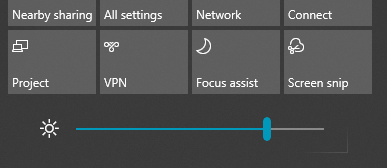

# Ekraani heleduse muutmine Windows 10

Kui Windows 10 on uuem kui versioon 1903, on **tegevuskeskuses heleduse** liugur. Tegevuskeskuse avamiseks klõpsake  tegumiriba kõige paremal küljel nuppu Teatis või vajutage **klaviatuuril klahvikombinatsiooni Windows home + A.**

Kui Windows 10 on varasem versioon, saate heleduse liuguri üles leida, kui soovitud Sätted > System > Display ( **[Kuva).](ms-settings:display?activationSource=GetHelp)**

**Märkmed**:

- Võimalik, et te ei näe välise kuvariga lauaarvutites sisseehitatud kuvari heleduse muutmise liugurit. Välise kuvari heleduse muutmiseks kasutage kuvari juhtelemente.
- Kui teil pole lauaarvutit ja liugurit ei kuvata ega tööta, proovige kuvadraiverit värskendada. Tippige tegumiriba otsinguväljale tekst **Seadmehaldur** ja seejärel **valige** tulemite loendist Seadmehaldur. Valige **seadmehalduris** **Kuvaadapterid** ja seejärel valige kuvaadapter. Vajutage pikalt kuvaadapteri nime (või paremklõpsake seda) ja klõpsake käsku **Värskenda draiver;** seejärel järgige juhiseid.
