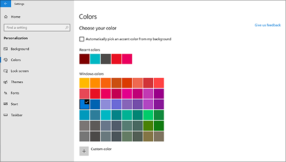
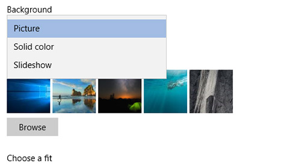

# Töölaua tausta ja värvide muutmine

Värvide sätte muutmiseks avage menüü **Start**  >  **Sätted** Isikupärastamisvärvid ja seejärel valige oma värv või laske Windows taustast  >    >  rõhuvärvi tõmmata.

Töölaua tausta muutmiseks avage menüü **Start** Sätted Isikupärastamise taust ja seejärel valige pilt, lausvärv või looge  >    >    >  piltide slaidiseanss. 

Kas soovite rohkem töölauataustu ja -värve? Külastage [Microsoft Store,](https://www.microsoft.com/store/collections/windowsthemes) et valida kümnete tasuta kujunduste seast.
