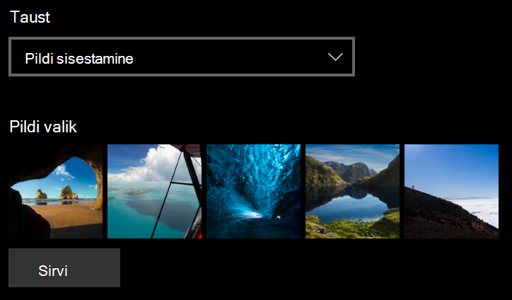
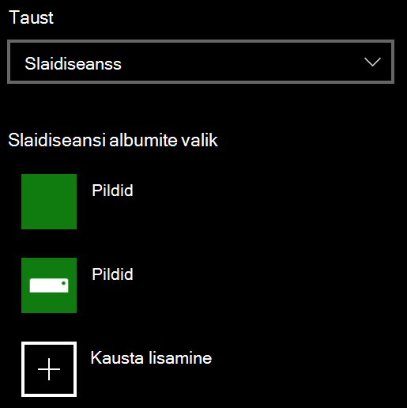

# Lukustuskuva tausta muutmineChange your lock screen background

- Avage **sätete**  >  **isikupärastamise**  >  **lukustuskuva.**Go to **Settings** > **Personalization** > **Lock screen**. Või klõpsake või puudutage [siin](ms-settings:lockscreen?activationSource=GetHelp).Or click or tap [here](ms-settings:lockscreen?activationSource=GetHelp).

- Kohandatud taustapildi **häälestamiseks** valige ripploendist **Taust** nupp Pilt ja valige või **Sirvige** pildini.To set a custom background picture, select **Picture** from the **Background** drop-down list, and choose or **Browse** to the picture.

  

- Kohandatud piltide slaidiseansi häälestamiseks valige  ripploendist  Taust suvand Slaidiseanss ja valige album või lisage slaidiseansi pilte sisaldav kaust.To set up a slideshow of custom pictures, select **Slideshow** from the **Background** drop-down list, and choose an album or add a folder that contains the pictures for the slideshow.

  
