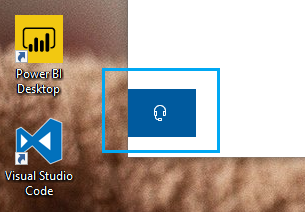

# Võtke meiega ühendust, klõpsates kõrvaklappide nuppuContact us by clicking the headphone button

Kui soovite võtta ühendust Microsofti tugiteenustega, klõpsake selle **rakenduse** vasakus allnurgas nuppu Võtke meiega ühendust.If you'd like to contact Microsoft Support, please click **Contact us** in the lower left corner of this app. Pärast toote- ja probleemikategooria valikut suunatakse teid aknast välja lendamise aknas õigele tugikanalile.Inside the fly-out window, you will be guided to the right support channel after choosing your product and issue category.

Saate ülejäänud rakendusega edasi suhelda ka pärast seda, kui olete algatanud seansi Võta meiega ühendust.You can keep interacting with the rest of the app even after you have initiated a Contact us session. Paneeli Kontakt saab ajutiselt minimeerida, klõpsates rakenduse mis tahes kohta.The Contact us panel can be temporarily minimized by clicking anywhere else inside the app. Samasse seanssi naasmiseks klõpsake lihtsalt **uuesti nuppu Võtke meiega** ühendust.To return to the same session, just click **Contact us** again.
