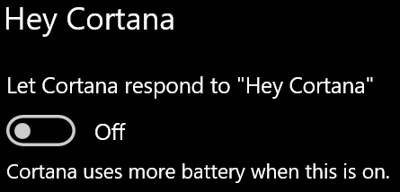

# Cortana ei räägi minuga või ei kuule mind

Kui proovite kasutada funktsiooni "Hey Cortana", mis võimaldab teil rääkida Cortana-ga ilma tegumiribal nuppu Cortana või mikrofoninuppu Cortana paanil, veenduge, et funktsioon on lubatud.

1. Avage **Start** ja seejärel **[valige Sätted > Cortana](ms-settings:cortana?activationSource=GetHelp)**.
2. Lülitage jaotises Hey Cortana Cortana (Hey **Cortana)**("Kuule Cortana" ("Kuule, **Cortana" vastamine)** asendisse **Sees**.

**Kas teie privaatsussätted takistavad Cortana teie kuulmist?**

Teie privaatsussätted võivad takistada Cortana teie häälele vastamist.
- Veenduge, et võrgukõnetuvastus oleks sisse lülitatud.
    - Avage **Menüü Start** ja seejärel **[klõpsake nuppu Sätted > Privaatsus ja > Kõne](ms-settings:privacy-speech?activationSource=GetHelp)**.
    - Valige **jaotises Veebipõhine** kõnetuvastus säte **Sees**.
- Kontrollige, kas Cortana on õigus teie mikrofonile juurde pääseda. 
    - Avage Menüü Start ja seejärel **[klõpsake nuppu Sätted > Privaatsus ja > Mikrofon](ms-settings:privacy-microphone?activationSource=GetHelp)**.
    - Otsige **jaotises Valige, millised rakendused pääsevad** teie mikrofonile **juurde, Cortana** rakenduste ja teenuste loendist pääsu ja veenduge, et lüliti oleks sisselülitatav **olekusse Sees.**

Lisaks veenduge, et kõlarid või mikrofonid on töökorras, et nendega Cortana.
