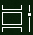

# Windows 10 multitegumtegemise abil rohkem ära tehaDo more with multitasking in Windows 10

Rakenduste kuvamiseks või vaheldumisi aktiveerimiseks võite klõpsata tegumiribal nuppu Ülesandevaade või vajutada klaviatuuril **muuteklahvi (Alt).** To see or switch between apps: you can click the **Task View** button in the taskbar, or press **Alt-Tab** on your keyboard. Nupp Ülesandevaade näeb välja selline.The Task View button looks like this:

Kahe rakenduse kõrvuti korraldamiseks kasutage tõmmeabi: haarake rakenduseakna ülaservast ja lohistage see ühele küljele, et "tõmmata" see ekraani sellele poolele.To easily arrange two apps side by side, use Snap Assist: grab the top of an app window and drag it to one side to "snap" it to that half of the screen. Seejärel valige mõni muu rakendus ja see tõmme automaatselt ekraani teises pooles kohale.Then choose another app and it will automatically snap into place in the other half of the screen.

**Kodu ja töö jaoks erinevate virtuaaltöölaudade loomiseks:****To create different virtual desktops for home and work**:

1. Klõpsake **tegumiribal nuppu** Ülesandevaade või vajutage klaviatuuril **muuteklahvi (Alt).**Click the **Task View** button in the taskbar, or press **Alt-Tab** on your keyboard.
2. Klõpsake **nuppu + Uus** töölaud (asub ülesandevaates kuva vasakus ülaservas).Click **+ New Desktop** (located at the top left of your screen while in task view).
3. Avage rakendused, mida soovite kasutada.Open the apps you want to use. 

Töölaua **kuvamiseks ja nende** vaheldumisi aktiveerimiseks minge tagasi ülesandevaatesse.Go back to **Task View** to see your desktops and switch between them.
