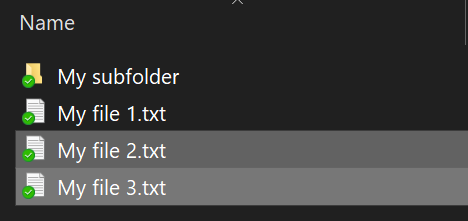
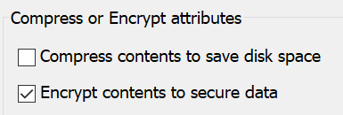

# Failide või kausta krüptimine opsüsteemis Windows 10Encrypt files or folder in Windows 10

BitLockeri abil saate krüptida kogu ketta, kuid ainult üksikute failide või kaustade (ja nende sisu) krüptimiseks:You can encrypt an entire disk using BitLocker, but to encrypt only individual files or folders (and their contents):

1. Valige **File Explorer**, kus valige failid/kaustad, mida soovite krüptida.In **File Explorer**, select the file(s)/folder(s) you want to encrypt. Selles näites on valitud kaks faili:In this example, two files have been selected:

    

2. Paremklõpsake valitud faile ja klõpsake käsku **Atribuudid**.Right-click the selected files and click **Properties**.

3. Klõpsake **Atribuudid** aknas **Täpsem**.In the **Properties** window, click **Advanced**.

4. **Täpsemad atribuudid** aknas valige **Krüpti sisu andmete turvalisuse tagamiseks** märkeruut:In the **Advanced Properties** window, select the **Encrypt contents to secure data** checkbox:

    

5. Klõpsake nuppu **OK**.Click **OK**.
