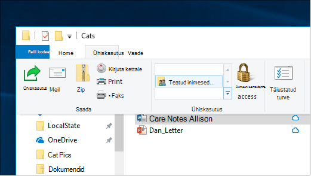
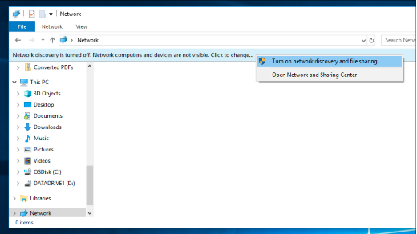

# Failide ühiskasutus võrgus Windows 10-s

**Märkus**: kui kasutasite varem failide ühiskasutust HomeGroupi, Pange tähele, et Kodurühm on Windows 10-st eemaldatud (versioon 1803). Nüüd saate jagada printereid ja faile, kasutades Windows 10 sisseehitatud funktsioone.

**Failide või kaustade ühiskasutus võrgu kaudu**

- Valige File **Exploreris**fail > klõpsake jaotises **ühiskasutus** > ülaosas vahekaarti **ühiskasutus** , klõpsake **konkreetseid inimesi**.

    
          
- Kui valite korraga mitu faili, saate neid kõiki samal viisil ühiskasutusse anda. See toimib ka kaustade jaoks.

**Failide ühiskasutusse andmine võrgus olevate seadmete nägemiseks**

- Avage **File Exploreris** **võrk**. Kui võrgutuvastus pole lubatud, kuvatakse tõrketeade "võrgutuvastus on välja lülitatud..."

- Klõpsake **võrgutuvastus on välja lülitatud** banner, seejärel klõpsake **Lülita võrgutuvastus ja failide ühiskasutus**.

    

[Lisateave failide ühiskasutuse kohta võrgus](https://support.microsoft.com/help/4092694/windows-10-file-sharing-over-a-network)

[Failide ühiskasutus rakenduste, OneDrive ' i, e-kirjade ja muu abil](https://support.microsoft.com/help/4027674/windows-10-share-files-in-file-explorer)
