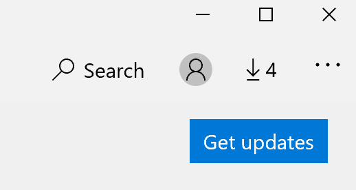

# Rakenduste kuvamiskeele parandusFix the display language of apps

Kui olete windows 10 kuvamiskeelt vahetanud, võivad mõned rakendused nende avamisel endiselt kasutada eelmist keelt.After you change the display language in Windows 10, some apps may still use the previous language when you open them. See juhtub seetõttu, et selle keele rakenduste uued versioonid tuleb poest alla laadida.This happens because new versions of the apps for that language must be downloaded from the Store. Selle probleemi lahendamiseks võite oodata automaatset värskendust või installida rakenduste värskendatud versiooni käsitsi.To fix this problem, you can either wait for the automatic update, or you can manually install the updated version of the apps.

Värskenduse käsitsi installimiseks avage **Microsoft Store** ja klõpsake paremas **ülanurgas** nuppu Allalaadimised ja värskendused.To manually install the update, open **Microsoft Store** and click **Downloads and updates** in the top right corner. Seejärel klõpsake **nuppu Hangi värskendused.**Then click **Get updates**. Kui pärast värskenduse lõpule viimist keelt ei muutu, taaskäivitage arvuti.If the language is not changed after the update is complete, try restarting your PC.

Lisateavet sisestus- ja kuvamiskeele sätete kohta leiate teemast [Sisestus- ja kuvamiskeele sätete haldamine opsüsteemis Windows 10.](https://support.microsoft.com/help/4027670/windows-10-add-and-switch-input-and-display-language-preferences)To read more about input and display language settings, see [Manage your input and display language settings in Windows 10](https://support.microsoft.com/help/4027670/windows-10-add-and-switch-input-and-display-language-preferences).
