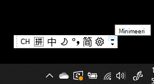
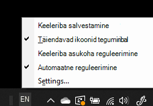

# Keeleriba peitmine, kuvamine või lähtestamine

**Keeleriba minimeerimiseks:**

Saate klõpsata keeleriba paremas ülanurgas olevat minimeerimisnuppu. Samuti saate lihtsalt lohistada keeleriba tegumiribale, mis minimeerib selle automaatselt.

**Keeleriba välja pop-out:**

Kui te ei soovi tegumiribal keeleriba dokkida, paremklõpsake tegumiribal tühja ala  ja tühjendage menüüs Tööriistaribad ruut Keeleriba. Nii kuvatakse keeleriba väljaspool tegumiriba nagu eelmisel kuvatõmmisel.

**Keeleriba vaikesaaste taastamiseks:**

Paremklõpsake tööriistaribal keelenuppu ja klõpsake menüüs **käsku Taasta** keeleriba suvand. See taastab selle vaikesätted.

