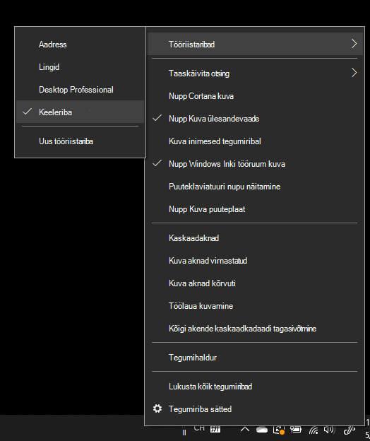

# Keeleriba peitmine, kuvamine või lähtestamineHide, display, or reset the language bar

**Keeleriba minimeerimiseks:****To minimize the language bar:**

Saate klõpsata keeleriba paremas ülanurgas olevat minimeerimisnuppu.You can click the minimize button on the top right corner of the language bar. Samuti saate lihtsalt lohistada keeleriba tegumiribale, mis minimeerib selle automaatselt.Or, you can just drag the language bar to the task bar, which will automatically minimize it.

**Keeleriba välja pop-out:****To pop out the language bar:**

Kui te ei soovi tegumiribal keeleriba dokkida, paremklõpsake tegumiribal tühja ala  ja tühjendage menüüs Tööriistaribad ruut Keeleriba.If you don't want to dock the language bar in the taskbar, right-click any empty space in the taskbar, and uncheck the **Language bar** option in the Toolbars menu. Nii kuvatakse keeleriba väljaspool tegumiriba nagu eelmisel kuvatõmmisel.This will make the language bar appear outside the taskbar, just like the previous screenshot.

**Keeleriba vaikesaaste taastamiseks:****To restore the language bar to default:**

Paremklõpsake tööriistaribal keelenuppu ja klõpsake menüüs **käsku Taasta** keeleriba suvand.Right-click the language button in the toolbar, and click **Restore the language bar** option in the menu. See taastab selle vaikesätted.This will restore it to default.

