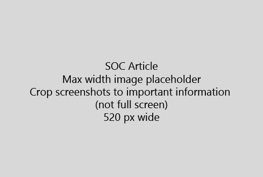

Alusta oma artikkel väga lühike tutvustus (1 lause). Ennast lugeja olemas - miks nad siin on? Mida nad teevad? 
  
1. Avage viivituseta kiire nimekirja samme täita ülesanne.
    
    Kui pead selgitama mõiste, või nad peavad eelnevalt vajaliku sammu tegema, lisada lühikokkuvõtet samm vajavad, ja mõiste või abinõude [link](https://support.office.com/article/f37e7984-cf03-4fde-92d3-82970d7e241b.aspx) allpool. 
    
2. Hoida kord lühike - soovitavalt 5 või vähem juhiseid, kuni 8.
    
3. Kasutage **Ui stiili** kasutajaliidese elemente või teksti inimest vaja. 
    
4. Verbiga valida, valige, või sisestage meetmeid ja menüüd vormindada **menüü** \> **käsk**.
    
5. Soovi korral lisage kuvatõmmis konteksti (kui UI on raske leida, või vaja ülesande).
    
    Maksimaalne laius: 520 pikslit. Kasutada standard kujunduse, näidata isikliku teabe ja näidata, mis on oluline ainult kärpida. 
    
    
  
Kui soovite lisada video või pilt, kasutada kahe veeruga grid ja on juhised vasakule ja video või pilt õigus - vt [samme ja video võre näiteks](https://support.office.com/article/14ce8e82-efa0-47f5-bb84-94f078db3dae.aspx). 
  
Sihtida üle 500 sõna artikkel.
  
# Näiteks artikli

[Muuda minu foto](https://support.office.com/article/555376e0-1fca-49ba-8434-307a0525c767.aspx)
  

