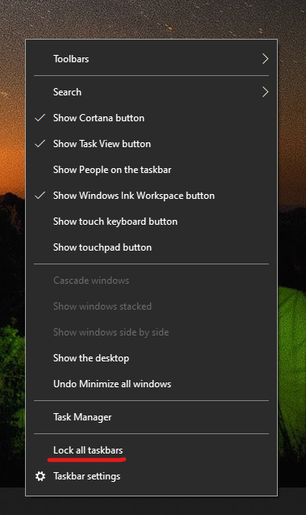

# Tegumiriba viimine töölaual vasakusse, paremasse või ülaservaMove the taskbar to either side or the top of your desktop

Esmalt veenduge, et tegumiriba poleks lukustatud.First, please confirm that the taskbar is unlocked. Kontrollimaks, kas see on lukustatud või mitte, paremklõpsake tegumiribal mõnda tühja kohta ja vaadake, kas käsu **Lukusta tegumiriba** ees on märge.To find out whether yours is unlocked, right-click any empty space on the taskbar and see whether **Lock the taskbar** has a checkmark next to it. Kui see käsk on märgitud, on tegumiriba lukus ja seda ei saa teisaldada.If there is a checkmark, the taskbar is locked and cannot be moved. Käsu **Lukusta tegumiriba** klõpsamisel avatakse see lukust ja märge eemaldatakse.Clicking **Lock the taskbar** once will unlock it and remove the checkmark.

Kui tegumiriba on kuvatud mitmel kuvaril, kuvatakse käsk **Lukusta kõik tegumiribad**.If you have multiple monitors that display the taskbar, you will see **Lock all taskbars**.

Kui olete tegumiriba lukust avanud, saate tegumiribal pikalt vajutada mõnda tühja kohta ja lohistada siis tegumiriba ekraanil soovitud asukohta.Once the taskbar is unlocked, you can press and hold any empty space on the taskbar and drag it to the location you want on the screen. Samuti võite selleks klõpsata tegumiribal mõnda tühja kohta ja valida siis **[Tegumiriba sätted](ms-settings:taskbar?activationSource=GetHelp) > Tegumiriba asukoht kuval**.You can also do so by right-clicking on any empty space on the taskbar and go to **[Taskbar settings](ms-settings:taskbar?activationSource=GetHelp) > Taskbar location on screen**.
