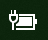

# Opsüsteemis Windows 10 puudub toite- või akuikoon

Kui kasutate akuga Windows 10 seadet (nt sülearvutit, tahvelarvutit või USB kaudu puhvertoiteallikaga ühendatud PC-arvutit), kuvatakse toite- või akuikoon tavaliselt tegumiribal kellaaja lähedal, nagu allpool on näidatud.

Kui seda ikooni pole näha, võib see olla peidetud.

1. Avage **[Sätted > Isikupärastamine > Tegumiriba](ms-settings:taskbar?activationSource=GetHelp)**.

2. Klõpsake olekuala jaotises nuppu **Saate valida tegumiribal kuvatavad ikoonid**.

3. Seejärel leidke loendist üksus **Toide** ja lülitage selle säte asendisse **Sees**.

    

**Tõrkeotsing**

Kui järgisite eespool toodud juhiseid, aga tumblerlüliti **Toide** on tuhm või pole nähtav, tippige tegumiriba otsinguväljale otsisõna **seadmehaldur** ja seejärel valige tulemiloendist **Seadmehaldur**. Paremklõpsake jaotises **Akud** oma seadme akut, klõpsake käsku **Keela seade** ja seejärel **Jah**. Oodake veidi ja paremklõpsake akut ja seejärel klõpsake käsku **Luba seade**. Seejärel taaskäivitage seade.

Kui järgisite eespool toodud juhiseid, kuid akuikooni tegumiribal ei kuvata, tippige tegumiriba otsinguväljale otsisõna **tegumihaldur** ja seejärel klõpsake tulemiloendis valikut **Tegumihaldur**. Paremklõpsake vahekaardil **Protsessid** jaotises **Nimi** valikut **Explorer** ja seejärel käsku **Taaskäivita**.
