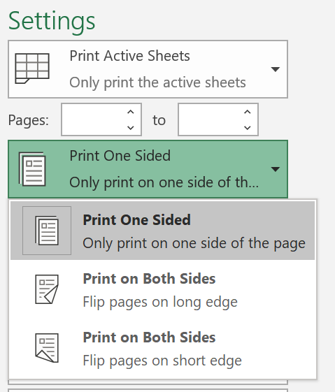
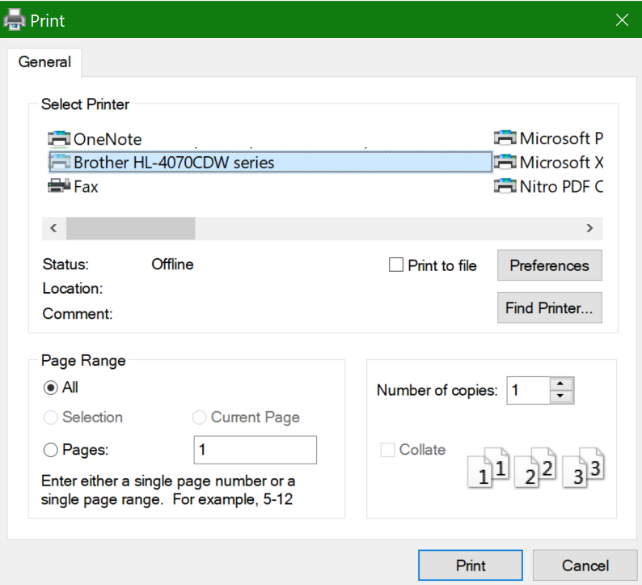

# Paberi mõlemale poolele printimine (kahepoolne print)Printing on both sides of paper (duplex printing)

**Kas minu printer suudab kahepoolset printimist?****Is my printer capable of duplex printing?**

Teie printeri funktsioonide kokkuvõte või juhend peaks teile ütlema, kas see on võimeline printima paberi mõlemale poolele, mida nimetatakse ka "kahepoolseks printimiseks".Your printer’s feature summary or manual should tell you whether it is capable of printing on both sides of the paper, also known as “duplex printing.” Kui teil on Microsoft Office, siis on teine võimalus teada saada, avades Office ' i rakenduse (nt Word või Excel), et avada **> printimine**, veenduge, et valitud on õige printer, ja otsib võimalusi jaotises sätted.If you have Microsoft Office, another way to find out is by opening an Office app like Word or Excel, going to **File > Print**, making sure the right printer is selected, and looking for the capability in the Settings section. Näiteks.For example: 

**Kahepoolne printimine Microsoft Office ' is****Duplex printing in Microsoft Office**

Kui teie printer on võimeline printima mõlemale küljele, kui avate Office ' i rakenduses **> Prindi** , kuvatakse teile suvand "mõlemale poolele printimine", nagu on näidatud Ülaltoodud näites.If your printer is capable of printing on both sides, when you go to **File > Print** in the Office app, you will see an option to “Print on Both Sides,” as shown in the example above.  Valige soovitud kahepoolse printimise tüüp (pöörake pikale servale või pöörake lühikesele servale) ja klõpsake Prindi alustamiseks nuppu **Prindi** .Select the type of duplex printing you want (flip on long edge, or flip on short edge), and click **Print** to start the printout.

**Kahepoolne printimine mis tahes rakendusest****Duplex printing from any application**

Paljudes rakendustes kuvatakse printimisel üldprindi dialoogiboks, mis näeb välja umbes järgmine:In many apps when you print you will see a general print dialog that looks like this: 

Veenduge, et valitud on õige printer, ja seejärel klõpsake akna printeri eelistused avamiseks nuppu **eelistused** .Make sure the right printer is selected, then click **Preferences** to open the printer preferences window. Kui printer suudab teha kahepoolset printimist, kuvatakse selles aknas võimalus selle praeguse prinditöö jaoks lubada.If the printer is capable of duplex printing, the ability to enable this for the current print job will show in that window.
