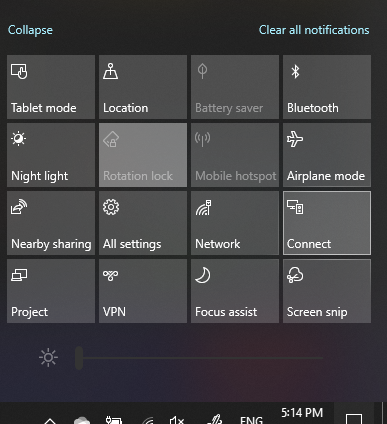

# Project PC-arvutisse

Kui olete sihtkoha seadmes (projektis), otsige "projektsiooni sätted", et avada **selle arvuti jaoks kavandamise**leht sätted. Siis veenduge, et:
- "Mõned Windowsi ja Androidi seadmed saavad selle ARVUTIGA Projecti, kui ütlete, et see on OK" rippmenüü on seatud **alati välja**.
- "Küsi selle PC-arvuti projekti" rippmenüü on seatud **iga kord, kui ühendust vajatakse**.
- Rippmenüüs "nõua PIN-koodi sidumist" on seatud **mitte kunagi**.

Kui olete sihtkoha seadmes, käivitage rakenduse **Connect** abil **Start** ja otsige märksõna "Connect" ("Connect").

Seejärel saate oma allika seadmes, kust proovite projekti valida:

1. Tegevuskeskuse avamiseks vajutage klahvikombinatsiooni **Windowsi klahv + A** .
2. Klõpsake nuppu **Ühenda**.
3. Klõpsake seadet, millele soovite ekraani kavandada.

Pärast ülaltoodud juhiseid peaks teie sihtkoha seade kuvama lähtefaili ekraani nii, nagu see oleks teisene kuvar.
