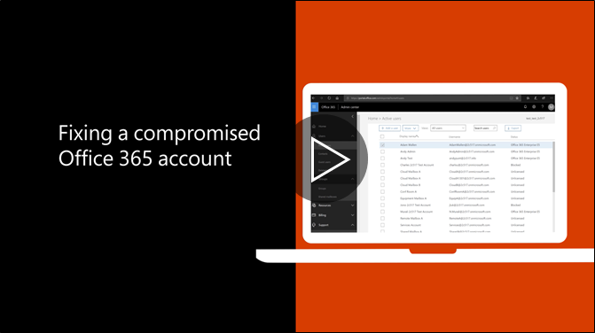

# Soovituslikke samme kui konto on ohus

  
1. [Kasutaja parooli lähtestamine](https://support.office.com/article/7a5d073b-7fae-4aa5-8f96-9ecd041aba9c) kohe. Teatavad kasutajale uus parool e-posti teel. 
    
2. Eemaldada kõik kahtlased [edastamine aadressid](https://support.office.com/article/ab5eb117-0f22-4fa7-a662-3a6bdb0add74) postkasti tasemel. 
    
3. Eemaldage kõik kahtlased [sisendkaustareeglid](https://support.office.com/article/1433E3A0-7FB0-4999-B536-50E05CB67FED) komplekti kuuluvate postkasti. 
    
4. Kui kasutaja on blokeeritud saata e-posti, [minge konto blokeeringu piirangutega kasutajad](https://protection.office.com/?hash=/restrictedusers). Kui teha, kasutaja peaks olema võimalik jätkata saatmine 1 tunni jooksul.
    
5. Eemaldada kasutaja konto mis tahes [haldus rollirühmade](https://support.office.com/article/eac4d046-1afd-4f1a-85fc-8219c79e1504) kuni olete kindel, et konto on enam ohustatud. 
    
Vältida võimalikku andmetega seotud rikkumisest või rikutud turvalisusega konto tulevikus, soovitame lugeda meie [Office 365 turvalisus parimad tavad artikli](https://support.office.com/article/9295e396-e53d-49b9-ae9b-0b5828cdedc3).
  

