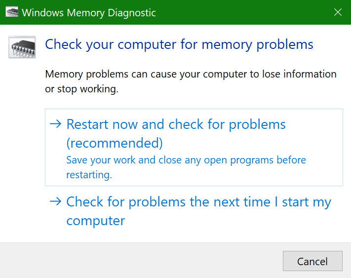
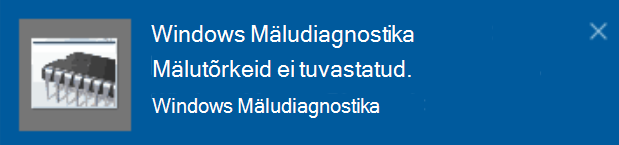

# Windowsi mäludiagnostika käivitamine opsüsteemis Windows 10

Kui Windows ja teie arvutis olevad rakendused krahhivad, külmutavad või käituvad ebastabiilselt, võib teil olla probleeme arvuti mäluga (RAM). Windowsi mäludiagnostika abil saate kontrollida arvuti muutmäluga seotud probleeme.

Tippige tegumiriba otsinguväljale mäludiagnostika ja seejärel valige **Windowsi mäludiagnostika**.  

Diagnostika käivitamiseks peab arvuti taaskäivitama. Saate kohe taaskäivitada (salvestage oma töö ja sulgege esmalt avatud dokumendid ja meilisõnumid) või ajastada diagnostika automaatseks käivitamiseks järgmisel arvuti taaskäivitamisel.

Kui arvuti taaskäivitub, käivitub **Windowsi mäludiagnostika** tööriist automaatselt. Olek ja edenemine kuvatakse diagnostika käivitamiseks ning teil on võimalus diagnostika tühistada, kui vajutate **klaviatuuril paoklahvi (ESC).**

Kui diagnostika on lõpule viidud, käivitub Windows tavapäraselt.
Kohe pärast taaskäivitamist kuvatakse töölaua kuvamisel teatis (tegumiribal tegevuskeskuse ikooni kõrval), mis näitab, kas mälutõrgei leiti.  Näide.

Tegevuskeskuse ikoon on järgmine.  

Ja näidisteatis: 

Kui te ei saanud teatist, saate tegevuskeskuse kuvamiseks  ja teatiste keritava loendi kuvamiseks valida tegumiribal tegevuskeskuse ikooni. 

Üksikasjaliku teabe läbivaatamiseks tippige **sündmus** tegumiriba otsinguväljale ja seejärel valige **Sündmusevaatur**. Liikuge **sündmusevaaturi** vasakpoolsel paanil lehele **Windowsi logid ja > System**. Otsige parempoolsel paanil loendit allapoole, vaadates veergu Allikas, **kuni** näete sündmusi, mille väärtus **on MemoryDiagnostics-Results**. Tõstke iga selline sündmus esile ja vaadake tulemiteavet loendi all **vahekaardi Üldist** väljal.
