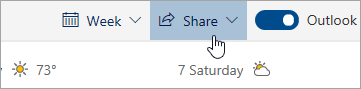

# Outlookiga ühiskasutus veebisSharing with Outlook on the web

1. Valige lehe allosas kalender, et minna kalendrisse.At the bottom of the page, select Calendar to go to Calendar.

2. Valige kalendris lehe ülaosas asuval tööriistaribal valik **ühiskasutus**ja valige Kalender, mida soovite ühiskasutusse anda.In Calendar, on the toolbar at the top of the page, select **Share**, and choose the calendar you want to share. 

    

    **Märkus**: te ei saa jagada kalendreid, mis kuuluvad teistele inimestele.**Note**: You can't share calendars owned by other people.

3. Sisestage selle isiku nimi või meiliaadress, kellega soovite kalendrit jagada.Enter the name or email address of the person you want to share your calendar with.

4. Valige, kuidas soovite, et inimene kasutaks teie kalendrit.Choose how you want the person to use your calendar: 
    - **Saab vaadata, kui ma olen hõivatud**   võimaldab neil näha, kui olete hõivatud, kuid ei sisalda üksikasju nagu sündmuse asukoht.**Can view when I'm busy** lets them see when you're busy but doesn't include details like the event location. 
    - **Saate vaadata tiitleid ja asukohti**   võimaldab neil näha, kui olete hõivatud, samuti sündmuste tiitel ja asukoht.**Can view titles and locations** lets them see when you're busy, as well as the title and location of events. 
    - **Saate vaadata kõiki üksikasju**   võimaldab neil näha kõiki teie sündmuste üksikasju.**Can view all details** lets them see all the details of your events. 
    - **Saab redigeerida**   võimaldab neil kalendrit redigeerida.**Can edit** lets them edit your calendar. 
    - **Delegaadi**   võimaldab neil kalendrit redigeerida ja teistega jagada.**Delegate** lets them edit your calendar and share it with others.

5. Valige **ühiskasutus**.Select **Share**. Kui otsustate oma kalendrit kohe mitte jagada, valige käsk **Eemalda**.If you decide not to share your calendar right now, select **Remove**. 

**Märkused**:**Notes**:  

- Kui jagate kalendrit kellegagi, kes ei kasuta Outlooki veebis, näiteks kedagi, kes kasutab Gmaili, saavad nad kutse aktsepteerida ainult Microsoft 365 või Outlook.com konto abil.When sharing your calendar with someone who's not using Outlook on the web, for example, someone using Gmail, they'll only be able to accept the invitation using a Microsoft 365 or an Outlook.com account. 

- ICS-kalendrid on kirjutuskaitstud, nii et isegi kui annate teistele inimestele redigeerimisjuurdepääsu, ei saa nad teie kalendrit redigeerida.ICS calendars are read-only, so even if you grant edit access to other people, they won't be able to edit your calendar. 

- Kui tihti teie ICS-i kalendrite sünkroonimine sõltub selle isiku meilipakkujalt, kellega olete seda jaganud.How often your ICS calendar syncs depends on the email provider of the person you've shared it with. 

- Privaatne märgitud kalendriüksused on kaitstud.Calendar items marked private are protected. Enamik inimesi, kellega oma kalendrit jagate, näevad ainult privaatseid, mitte pealkirja, asukohta või muid üksikasju.Most people you share your calendar with see only the time of items marked private, not the title, location, or other details. Korduvad sarja tähistatud privaatne näitab ka kordumise muster.Recurring series marked as private will also show the recurrence pattern.
