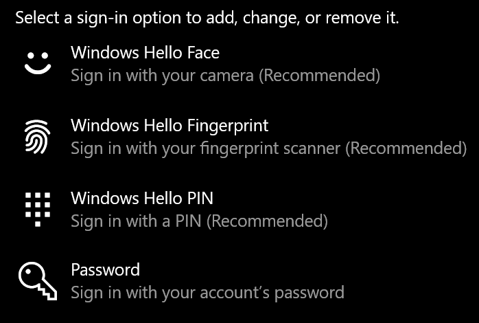

# Windows 10 sisselogimine ilma paroolitaSign-in to Windows 10 without using a password

Windowsi käivitamisel parooli tippimise vältimiseks soovitame kasutada ühte Windows Hello turvalist sisselogimissuvandeid (nt PIN-kood, näotuvastus või sõrmejälg), kui see on saadaval.To avoid having to type a password at Windows startup, we recommend you use one of the Windows Hello secure sign-in options, like a PIN, face recognition, or fingerprint, if available. Kui soovite turvalise sisselogimise keelata, lugege allpool toodud juhiseid "Logi automaatselt windows 10 sisse".If you really want to disable secure sign-in, see the "Automatically sign in to Windows 10" instructions below.

**Secure Windows Hello alternatives to the account password****Secure Windows Hello alternatives to the account password**

Avage **Sätted > Kontod > sisselogimissuvandid** (või klõpsake [siin).](ms-settings:signinoptions?activationSource=GetHelp)Go to **Settings  > Accounts > Sign-in options** (or click [here](ms-settings:signinoptions?activationSource=GetHelp)). Kuvatakse saadaolevad sisselogimissuvandid.Available sign-in options will be listed. Näide.For example:

Konfigureerimiseks klõpsake või puudutage ühte suvanditest.Click or tap one of the options to configure it. Järgmine kord, kui käivitate või avate Windowsi, saate parooli asemel kasutada uut suvandit.Next time you start or unlock Windows, you will be able to use the new option instead of a password. 

**Windows 10 automaatne sisselogimine****Automatically sign-in to Windows 10**

**Märkus.** Automaatne sisselogimine on mugav, kuid see kehtestab turberiski, eriti juhul, kui teie arvutile pääsevad juurde mitu inimest.**Note**: Automatic sign-in is convenient, but introduces a security risk, especially if your PC is accessible by multiple people. 

1. Klõpsake või **puudutage tegumiribal** nuppu Start.Click or tap the **Start** button in the Taskbar.

2. Tippige **netplwiz** ja vajutage akna Kasutajakontod avamiseks sisestusklahvi (Enter).Type **netplwiz** and hit the Enter key to open the User Accounts window.

3. Klõpsake **kaustas Kasutajakontod** kontot, kuhu soovite Windowsi käivitamisel automaatselt sisse logida.In **User Accounts**, click the account you want to automatically sign in to when Windows starts.

4. Tühjendage ruut "Kasutajad peavad selle arvuti kasutamiseks sisestama kasutajanime ja parooli".Uncheck the "Users must enter a user name and password to use this computer" checkbox.

    

5. Klõpsake nuppu **OK**.Click **OK**. Teil palutakse sisestada ja kinnitada valitud konto parool.You will be asked to enter and confirm the password for the account you selected. Lõpetamiseks klõpsake nuppu **OK.**Click **OK** to finish. Järgmine kord, kui Windows 10 käivitub, logitakse see automaatselt teie valitud kontole sisse.Next time Windows 10 starts, it will automatically sign in to the account you selected.
