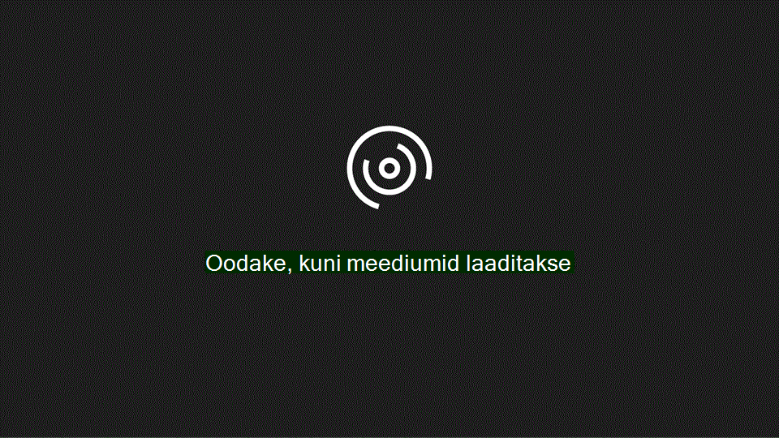

# Domeeni ja kasutajate häälestamineSet up domain and users

Kui olete valmis oma domeeni ja kasutajaid häälestama, vaadake seda kiiret videot.When you're ready to set up your domain and users, watch this quick video:
  

  
Lisateavet leiate teemast [domeenide KKK.](https://docs.microsoft.com/microsoft-365/admin/setup/domains-faq)For more information, see the [Domains FAQ.](https://docs.microsoft.com/microsoft-365/admin/setup/domains-faq)