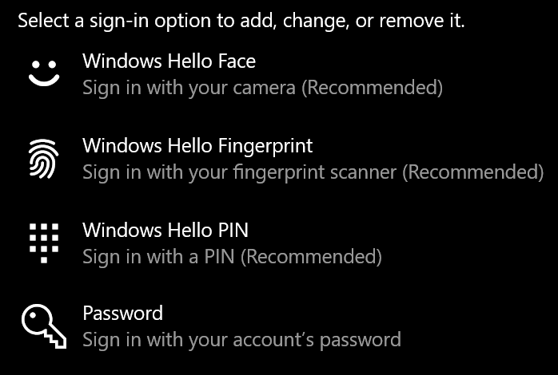
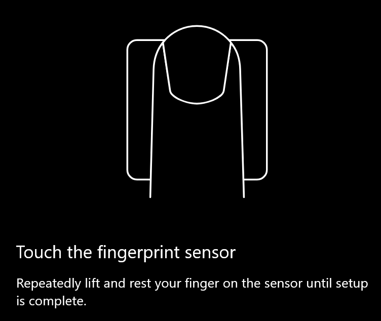
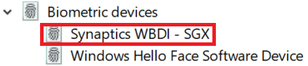

# Sõrmejälje avamise suvandi kasutamine Windows 10-s

**Luba Windows Hello sõrmejälg**

Windows 10 avamiseks sõrmejälje abil peate seadistama Windows Hello sõrmejälje, lisades (lastes Windowsil seda ära tunda) vähemalt üks sõrm. 

1. Avage **sätted > kontod > Sisselogimissuvandid** (või klõpsake [siin](ms-settings:signinoptions?activationSource=GetHelp)). Saadaolevad Sisselogimissuvandid loetletakse. Näiteks.

    

2. Klõpsake või koputage **Windows Hello sõrmejälg**, seejärel klõpsake nuppu **Seadista**. Klõpsake aknas Windows Hello häälestus **nuppu Alusta.** Sõrmejäljeandur aktiveeritakse ja teil palutakse panna sõrm sensoril:

   

3. Järgige juhiseid, mis palub teil oma sõrme korduvalt skannida. Kui see on lõppenud, on teil võimalus lisada muid sõrmi, mida võiksite sisselogimiseks kasutada. Järgmine kord, kui logite sisse Windows 10, on teil võimalus kasutada oma sõrmejälg seda teha.

**Windows Hello sõrmejälg pole sisselogimissuvandiga saadaval**

Kui Windows Hello sõrmejälge ei kuvata **Sisselogimissuvandite**suvandiga, tähendab see, et Windows ei tea ühtegi teie arvutiga ühendatud sõrmejäljelugejat/skannerit või süsteemipoliitika takistab selle kasutamist (nt teie arvuti haldab teie töökoht). Tõrkeotsingu sooritamiseks toimige järgmiselt. 

1. Valige tegumiribal nupp **Start** ja otsige **seadmehaldurit**.

2. Klõpsake või koputage **Seadmehalduri**avamiseks.

3. Laiendage Seadmehalduris biomeetrilisi seadmeid, klõpsates selle glüüfi.

   

4. Sõrmejäljelugeja tuleks loetleda biomeetrilise seadena (nt Synaptics WBDI skanner):

   

5. Kui sõrmejäljelugeja ei kuvata ja skanner on arvutisse integreeritud, arvuti tootja veebisaidile. Otsige oma arvuti mudeli tehnilise toe sektsioonis üles Windows 10 draiver skanneri jaoks, mida saate installida.

6. Kui skanner on ARVUTIST eraldi (manustatud USB kaudu), skanneri tootja veebisaidile, et leida ja installida Windows 10 seadmedraiveri tarkvara teie skanneri mudelile.
