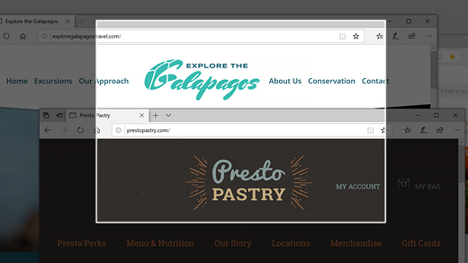
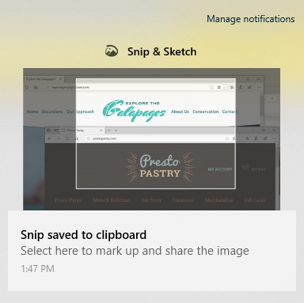

# Piltide hõivamiseks, märgistamiseks ja jagamiseks kasutage lõiget & eskiisUse Snip & Sketch to capture, mark up, and share images

Ekraani visandit nimetatakse nüüd **lõikeks & visand**.Screen sketch is now called **Snip & Sketch**. **Lõike kiireks tegemiseks tehke**järgmist.**To quickly take a snip**:

1. Vajutage klahvikombinatsiooni **Windowsi logoga klahv + SHIFT + S**. Näete ekraani tumedam ja kursor kuvatakse ristina.Press the **Windows logo key + Shift + S**. You'll see your screen darken and your cursor displayed as a cross. 

2. Valige selle ala servas, mida soovite kopeerida, ja klõpsake kursori vasakus servas.Choose a point at the edge of the area you want to copy and left-click the cursor. 

3. Liigutage kursorit, et tõsta esile ala, mida soovite hõivata.Move your cursor to highlight the area you want to capture. Teie jäädvustatud ala kuvatakse ekraanil.The area you capture will appear on your screen.

   

Lõikeandmete pilt salvestatakse lõikelauale, valmis kleepimiseks meilisõnumisse või dokumenti.The image you snipped is saved to your clipboard, ready for pasting into an email or document. 

**Kui soovite pilti redigeerida või vaadata,** tehke järgmist.**If you want to edit or view the image**: 

- Klõpsake tegumiriba paremas servas ikooni teatised. seejärel klõpsake äsja pildistatud pilti.Click the notifications icon at the far right side of the taskbar; then click the picture you have just captured. Lõige avaneb rakenduses lõige & eskiis.Your snip opens in the Snip & Sketch app.

   
