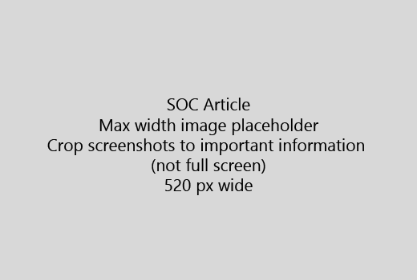

Alusta oma artikkel väga lühike tutvustus (1 lause). Ennast lugeja olemas - miks nad siin on? Mida nad teevad?Start your article with a very short introduction (1 sentence). Put yourself in the reader's place - why are they here? What should they do? 
  
1. Avage viivituseta kiire nimekirja samme täita ülesanne.Get straight to a quick list of steps to accomplish the task.
    
    Kui pead selgitama mõiste, või nad peavad eelnevalt vajaliku sammu tegema, lisada lühikokkuvõtet samm vajavad, ja mõiste või abinõude [link](https://support.office.com/article/f37e7984-cf03-4fde-92d3-82970d7e241b.aspx) allpool.If you need to explain a concept, or they have to do pre-requisite steps, add a quick summary below the step where they need it, and [link](https://support.office.com/article/f37e7984-cf03-4fde-92d3-82970d7e241b.aspx) to the concept or steps. 
    
2. Hoida kord lühike - soovitavalt 5 või vähem juhiseid, kuni 8.Keep procedures short - preferably 5 or fewer steps, no more than 8.
    
3. Kasutage **Ui stiili** kasutajaliidese elemente või teksti inimest vaja.Use **Ui style** for user interface elements or for text people need to enter. 
    
4. Verbiga valida, valige, või sisestage meetmeid ja menüüd vormindada **menüü** \> **käsk**.Use the verbs choose, select, or enter as actions, and format menus as **Menu** \> **Command**.
    
5. Soovi korral lisage kuvatõmmis konteksti (kui UI on raske leida, või vaja ülesande).Optionally, add a screenshot for context (if UI is hard to locate, or it's needed to complete the task).
    
    Maksimaalne laius: 520 pikslit. Kasutada standard kujunduse, näidata isikliku teabe ja näidata, mis on oluline ainult kärpida.Maximum width: 520 pixels. Use a standard theme, do not show any personal information, and crop to show only what's relevant. 
    
    
  
Kui soovite lisada video või pilt, kasutada kahe veeruga grid ja on juhised vasakule ja video või pilt õigus - vt [samme ja video võre näiteks](https://support.office.com/article/14ce8e82-efa0-47f5-bb84-94f078db3dae.aspx).If you want to add a video or screenshot, use a two-column grid and have the steps in the left and the video or screenshot in the right - see [Steps and video grid example](https://support.office.com/article/14ce8e82-efa0-47f5-bb84-94f078db3dae.aspx). 
  
Sihtida üle 500 sõna artikkel.Target no more than 500 words for an article.
  
# Näiteks artikliExample article

[Muuda minu fotoChange my photo](https://support.office.com/article/555376e0-1fca-49ba-8434-307a0525c767.aspx)
  

