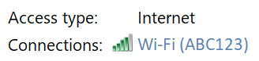
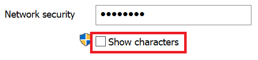

# Võrguparooli Wi-Fi windows 10-s

1. Veenduge, et teie Windows 10 arvuti oleks ühendatud Wi-Fi võrguga.

2. Avage **Sätted > Network & Internet > Olek** või klõpsake või [puudutage](ms-settings:network?activationSource=GetHelp) siin, et teid kohe sinna viidaks.)

3. Klõpsake **nuppu Võrgu- ja ühiskasutuskeskus.**

    

4. Võrgu- **ja ühiskasutuskeskuses** kuvatakse välja **Ühendused** kõrval raadiovõrgu nimi. Näiteks kui teie võrgu nimi on "ABC123", võidakse kuvada:

    

    Klõpsake akna Olek avamiseks raadiovõrgu Wi-Fi nime. 

5. Klõpsake Wi-Fi olekuaknas raadionuppu **Raadiovõrgu** atribuudid , seejärel vahekaarti **Turve** ja märkige ruut **Kuva märgid**.

    

