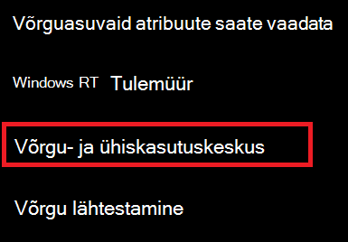

# Võrguparooli Wi-Fi windows 10-sView Wi-Fi network password in Windows 10

1. Veenduge, et teie Windows 10 arvuti oleks ühendatud Wi-Fi võrguga.Make sure your Windows 10 PC is connected to the Wi-Fi network.

2. Avage **Sätted > Network & Internet > Olek** või klõpsake või [puudutage](ms-settings:network?activationSource=GetHelp) siin, et teid kohe sinna viidaks.)Go to **Settings  > Network & Internet  > Status**, or click or tap [here](ms-settings:network?activationSource=GetHelp) to let us take you there now.)

3. Klõpsake **nuppu Võrgu- ja ühiskasutuskeskus.**Click **Network and Sharing Center**.

    

4. Võrgu- **ja ühiskasutuskeskuses** kuvatakse välja **Ühendused** kõrval raadiovõrgu nimi.In **Network and Sharing Center**, next to **Connections**, you will see the name of your wireless network. Näiteks kui teie võrgu nimi on "ABC123", võidakse kuvada:For example, if your network is named "ABC123," you might see:

    

    Klõpsake akna Olek avamiseks raadiovõrgu Wi-Fi nime.Click the wireless network name to open the Wi-Fi Status window. 

5. Klõpsake Wi-Fi olekuaknas raadionuppu **Raadiovõrgu** atribuudid , seejärel vahekaarti **Turve** ja märkige ruut **Kuva märgid**.In the Wi-Fi Status window, click **Wireless Properties**, click the **Security** tab, and check **Show characters**.

    

